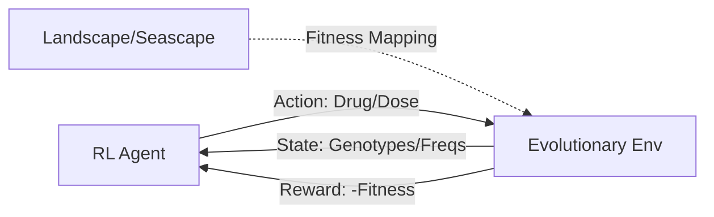

# evodm V2

An RL-Based Framework for Controlling Bacterial and Carcinomic Populations under Strong Selection Weak Mutation (SSWM) and Wright-Fisher evolutionary dynamics.

<!---badges-->
[](https://github.com/DavisWeaver/evo_dm/actions)
[](https://www.gnu.org/licenses/gpl-3.0)
[](https://codecov.io/gh/DavisWeaver/evo_dm)
[](https://hits.seeyoufarm.com)
<!---badges end-->

## Overview

`evodm` is a reinforcement learning (RL) framework designed to discover optimal dosing strategies to control a cancer or bacterial population. It models the population using two different evolutionary dynamics (SSWM and Wright-Fisher) and uses RL agents (PPO, DQN) to learn treatment policies that minimize population fitness and prevent resistance.

## Key Features

- **Dual Evolutionary Models**: 
  - **SSWM**: Focuses on fixation events in genotype space.
  - **Wright-Fisher**: Simulates population frequencies, drift, and selection.
- **Seascape Modeling**: Accounts for concentration-dependent fitness (Pharmacodynamics).
- **RL Integrated**: Built-in support for Tianshou (PPO, DQN) and custom Deep Q-Learning.
- **Experimental Data**: Includes empirical fitness landscapes from Mira et al. (2015).

## Getting Started

### Installation
```bash
# Clone the repository
git clone https://github.com/DavisWeaver/evo_dm.git
cd evo_dm

# Install dependencies (using uv or pip)
uv sync
```

### Quick Run
Check out `examples/run.py` to see how to train and evaluate an agent:
```bash
uv run examples/run.py
```

## Documentation

Comprehensive documentation is available in the `docs/` directory:
- [**Architecture Overview**](docs/architecture.md): How the system is built.
- [**Evolutionary Methodology**](docs/methodology.md): Details on SSWM and Wright-Fisher dynamics.
- [**RL Integration**](docs/rl_integration.md): How to train and use reinforcement learning agents.
- [**Refactoring Proposals**](docs/refactoring_proposals.md): Recommendations for project organization.

## Architecture



## Authors

- **Original Authors**: Davis Weaver and Jeff Maltas
- **V2 Author**: Chaaranath Badrinath
